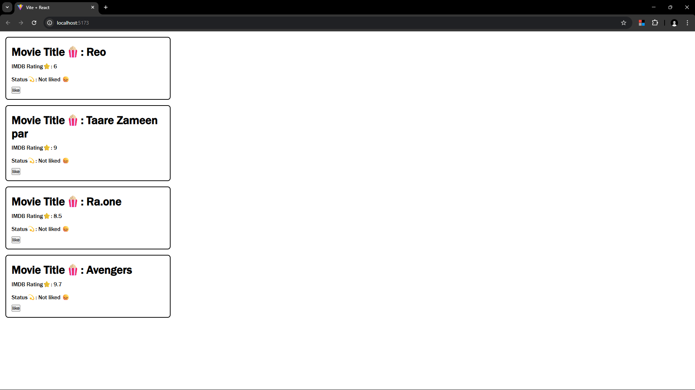

# React Mini Project – Reusable Card Component

This is a mini project built using **React + Vite**, where we create a **reusable Card component** to display movie information along with interactive "Like/Unlike" functionality using React's `useState` hook.

## 🧩 Features

- Reusable **Card** component
- Accepts props (`title`, `rating`) from the `App` component
- Displays movie title and IMDB rating
- Shows **Liked / Not Liked** status based on user interaction
- Toggle button to like/unlike the card
- Fully functional using React Hooks

## 📂 Folder Structure
├── public/
│ └── vite.svg
├── src/
│ ├── assets/
│ ├── components/
│ │ ├── Card.jsx
│ │ └── Card.css
│ ├── App.jsx
│ ├── App.css
│ ├── main.jsx
│ └── index.css
├── .gitignore
├── package.json
├── vite.config.js
└── README.md


## 🚀 How to Run the Project

1. **Clone the repo**  
    ```bash
   git clone https://github.com/yourusername/react-card-component.git

2. Install dependencies
  ```bash
   npm install

3. Start the dev server
  ```bash
  npm run dev

4. Open your browser at http://localhost:5173

🛠️ Tech Stack
✔️React
✔️Vite
✔️CSS
✔️JavaScript (ES6+)

🧠 Learning Objectives
☑️Using React props to pass dynamic data
☑️Managing component state with useState
☑️Conditional rendering in JSX
☑️Reusability in component design

📸 Demo Screenshot

🧑‍💻 Author
Aditya Saxena